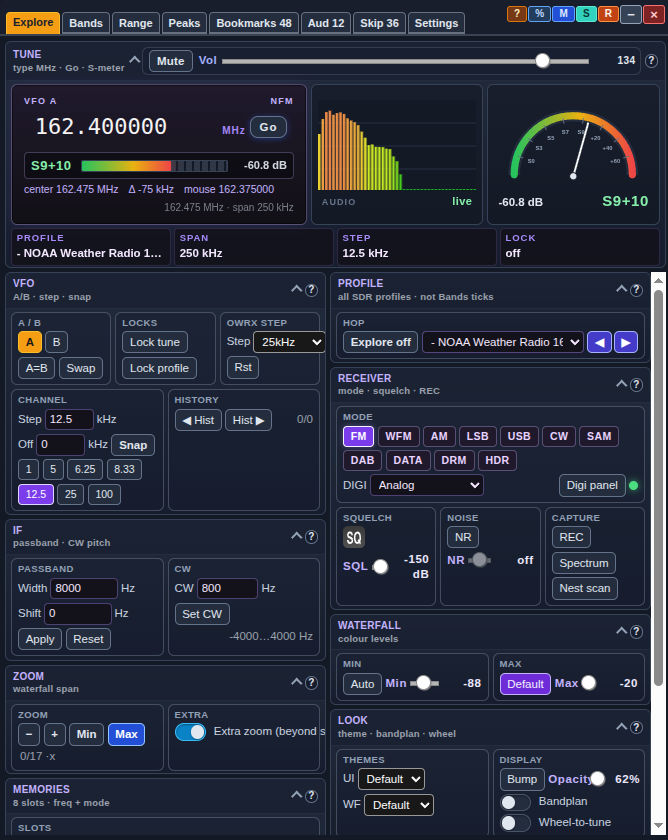
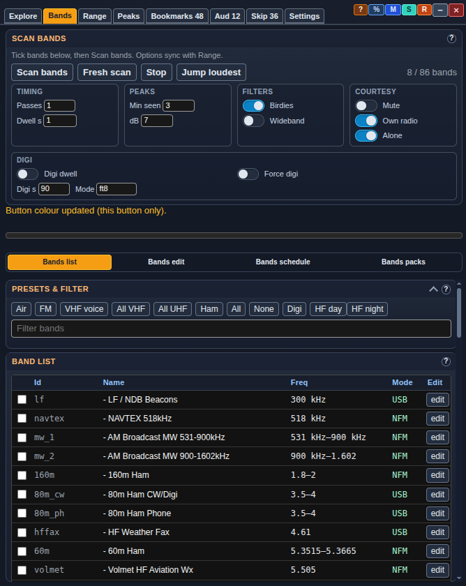
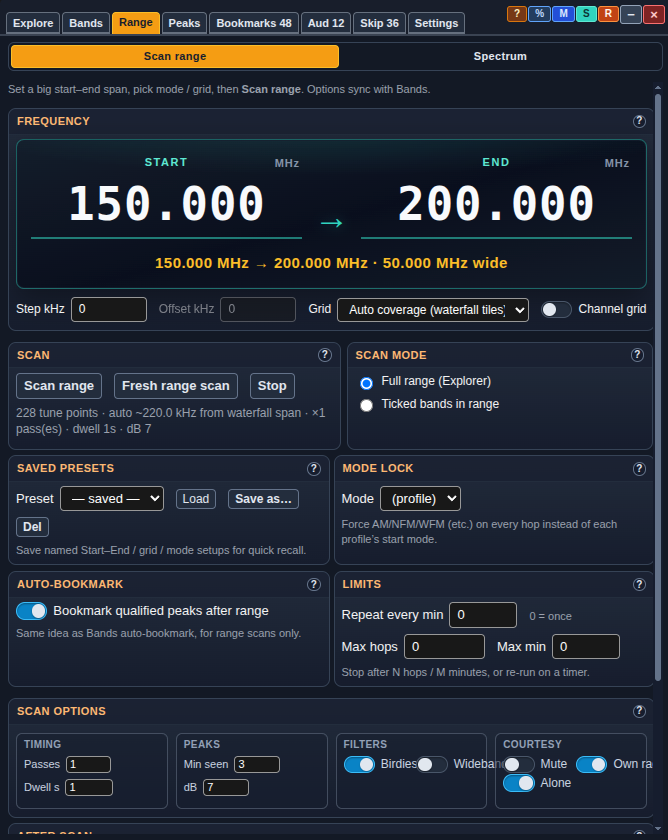
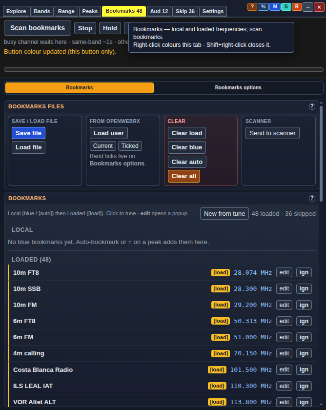
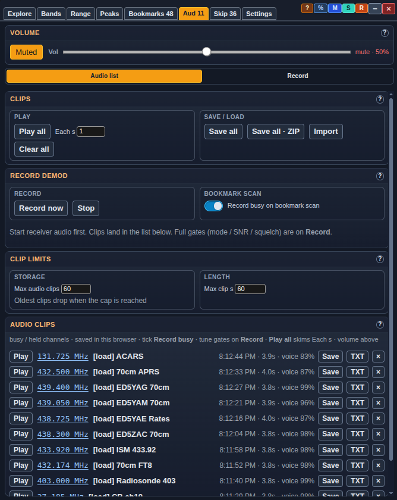
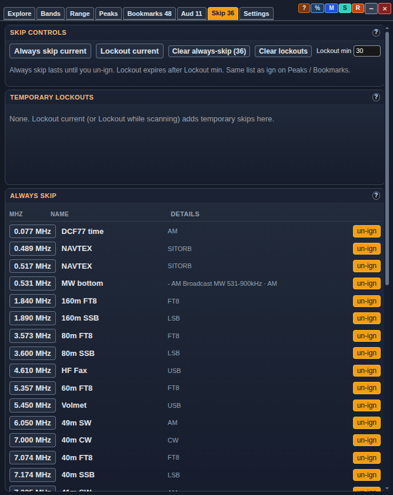
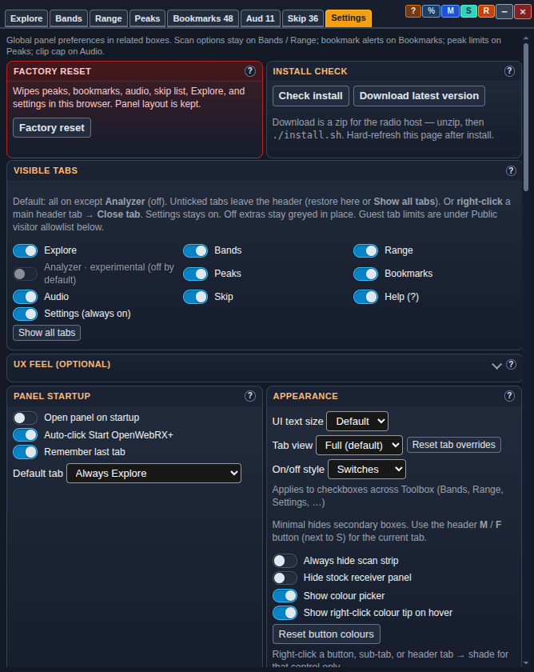
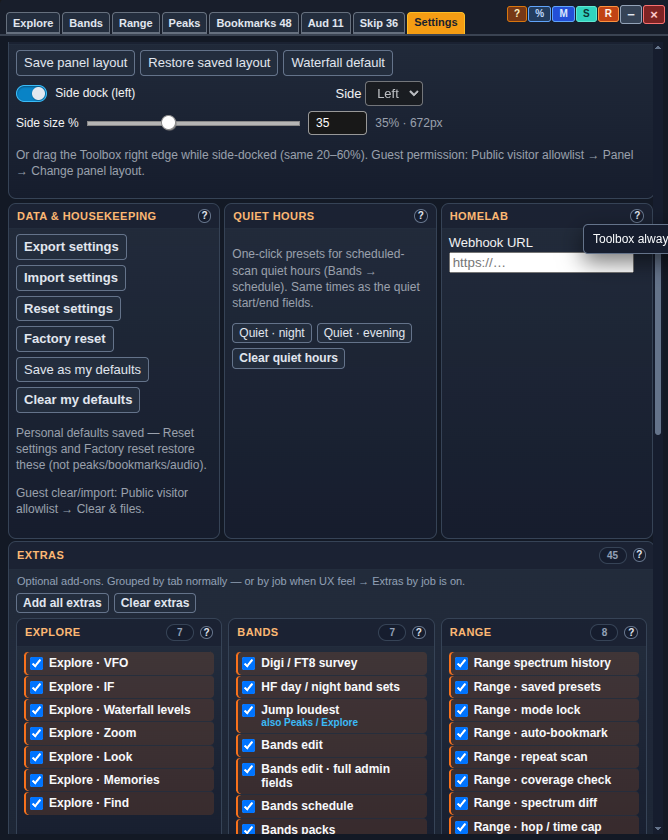
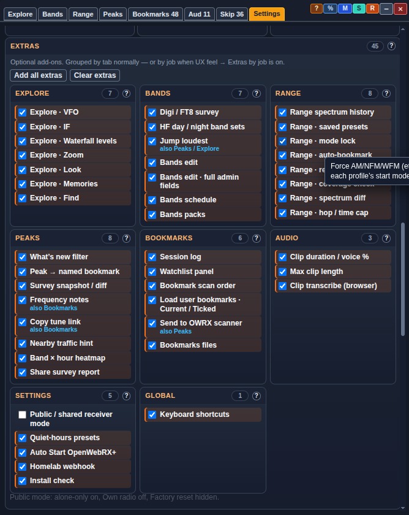
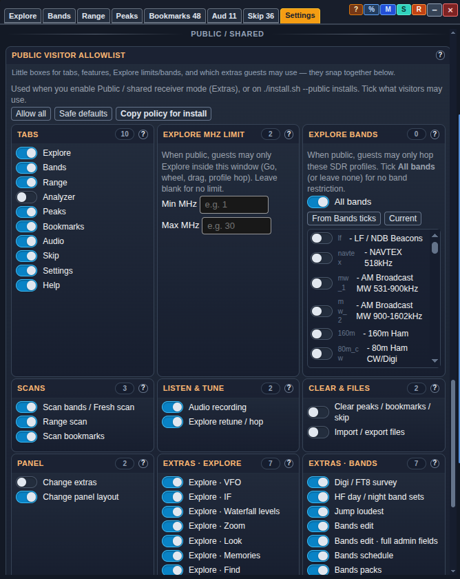

# OpenWebRX Toolbox (v413)

**OpenWebRX+ receiver plugin** — band / range survey, Explore, peaks, bookmarks,
audio clips, and more. Formerly **Band Survey** (`band_survey`). Plugin id is now
`toolbox`.

> **Repo:** [G4EA5/openwebrx-toolbox](https://github.com/G4EA5/openwebrx-toolbox)
> (same repository; display name **OpenWebRX Toolbox**). Older **Band Survey**
> builds remain downloadable — see [Band Survey (legacy)](#band-survey-legacy).

Standalone plugin. Walks the bands you tick (or a custom MHz range), counts real
waterfall peaks, ranks the busiest, and can bookmark them in **this browser**.

**Works with any SDR OpenWebRX+ supports** (HackRF, RTL-SDR, Airspy, Lime, …) —
the plugin talks to the OpenWebRX+ UI, not to USB hardware. See
[SDR hardware](#sdr-hardware-hackrf-rtl-sdr-airspy-lime--).

### What’s new (high level)

| Area | Highlights |
| --- | --- |
| **Rename** | **OpenWebRX Toolbox** (`toolbox`) replaces Band Survey; installer migrates safely |
| **Explore** | Drag-reorder boxes; **Wide** / **Half** size; receiver controls, S-meter, side dock |
| **Audio** | Clip archive, record modes, export for digi tools |
| **Public** | Admin switch in OpenWebRX **Settings → General**; visitor allowlist for guests |
| **Settings** | Toolbox Settings tab is **admin-only**; mute-on-tab-hide, personal defaults, UX feel |
| **Legacy** | Band Survey **v127** under [`legacy/band_survey/`](legacy/band_survey/) |
| **Docs** | README + Help **v413** — Explore layout (Wide/Half), public mode via stock admin Settings |

---

## Where to start

After [install](#install) and a hard-refresh (**Ctrl+Shift+R** / **Cmd+Shift+R**),
open the receiver page and click **Toolbox** in the **top bar** — between **Help**
and **Status** (bar-graph icon). That opens the Toolbox panel. If the top bar is
missing, look for **TB** on the frequency bar (fallback).

<p><em>Click <strong>Toolbox</strong> in the top bar, then Settings → <strong>Check install</strong>.</em></p>

**Does not need** `freq_scanner`, `scan_hunt`, `uikit`, `utils`, or `notify`. Those
are optional extras if you already load them.

---

## Band Survey (legacy)

This project used to be **Band Survey** only. **OpenWebRX Toolbox** is the current
plugin and includes every Band Survey feature plus much more.

| Want | How |
| --- | --- |
| **Current plugin (recommended)** | `./install.sh` → loads `toolbox` |
| **Last Band Survey (v127)** | [`legacy/band_survey/`](legacy/band_survey/) |
| **Band Survey v110** | GitHub Release / tag **`band-survey-v110`** |
| **Any older build** | [Releases](https://github.com/G4EA5/openwebrx-toolbox/releases) or `git checkout <tag>` |

**Do not load `band_survey` and `toolbox` together** — they share UI hooks and will
clash. The installer always configures `init.js` to load **only Toolbox**.

CDN pin for a specific Band Survey version (use a tag — root `band_survey.js`
only exists on older tags, not on current `main`):

```js
await Plugins.load("https://cdn.jsdelivr.net/gh/G4EA5/openwebrx-toolbox@band-survey-v110/band_survey.js");
/* Last Band Survey on main: */
await Plugins.load("https://cdn.jsdelivr.net/gh/G4EA5/openwebrx-toolbox@main/legacy/band_survey/band_survey.js");
```

---

## Screenshots

<p>
  <strong>Explore</strong> — tune, S-meter, modes, waterfall / IF / zoom<br>
  
</p>
<p>
  <strong>Bands</strong> — scan options, presets, band list<br>
  
</p>
<p>
  <strong>Range</strong> — custom start–end MHz scan<br>
  
</p>
<p>
  <strong>Bookmarks</strong> — local / loaded lists, scan bookmarks<br>
  
</p>
<p>
  <strong>Audio</strong> — clip archive, record busy, volume<br>
  
</p>
<p>
  <strong>Skip</strong> — always-skip list and lockouts<br>
  
</p>
<p>
  <strong>Settings</strong> — visible tabs, appearance, Check install<br>
  
</p>
<p>
  <strong>Settings</strong> — side dock, data, quiet hours, extras<br>
  
</p>
<p>
  <strong>Extras</strong> — optional features grouped by tab<br>
  
</p>
<p>
  <strong>Public visitor allowlist</strong> — shared-receiver guest limits<br>
  
</p>

---

## SDR hardware (HackRF, RTL-SDR, Airspy, Lime, …)

**OpenWebRX Toolbox** is an **OpenWebRX+ browser plugin**. It does **not** open
`/dev/hackrf0`, run `hackrf_sweep`, or talk to Soapy/USB itself.

| Layer | Role |
| --- | --- |
| Your SDR (HackRF, RTL-SDR, …) | Owned by OpenWebRX+ / SoapySDR |
| OpenWebRX+ receiver page | Profiles, waterfall FFT, tune / profile hop |
| Toolbox | Reads waterfall, switches profiles, bookmarks in **this browser** |

**If** OpenWebRX already shows a normal waterfall and an SDR profile list for that
radio, this plugin can survey it — same code path for HackRF, RTL-SDR, Airspy, Lime,
etc.

Practical differences by setup:

- **Profiles must cover the MHz you scan.** Range, Explore, and Analyzer only hop
  where profiles allow.
- **Bandwidth comes from OpenWebRX** (`window.bandwidth`).
- **Presets** (Air, FM, …) match common profile id/name patterns. Custom names still
  work — tick bands manually or use **All**.
- **Analyzer** (experimental, off by default) draws from the live OWRX waterfall
  (relative dB). It is **not** a standalone
  [HackRF sweep visualizer](https://github.com/G4EA5/hackrf_sweep_visualizer_v1).
- Vanilla OpenWebRX (no `+`) cannot load plugins.

---

## Install

### Quick install (recommended)

On the radio host:

```bash
git clone https://github.com/G4EA5/openwebrx-toolbox.git
cd openwebrx-toolbox
chmod +x install.sh
./install.sh          # blue-screen wizard (dialog/whiptail) when interactive
./install.sh --no-tui # plain-text prompts on minimal systems
```

Hard-refresh the receiver: **Ctrl+Shift+R** (Mac: **Cmd+Shift+R**). Click
**Toolbox** → **Settings** → **Check install**.

### Upgrading from Band Survey (`band_survey`)

**Recommended: Toolbox only.**

```bash
./install.sh --remove-legacy   # delete old band_survey, install Toolbox  ★ recommended
./install.sh --keep-legacy     # keep band_survey folder on disk; only Toolbox loads
./install.sh --purge-legacy    # remove old band_survey only (no Toolbox file copy)
```

Interactive installs ask the same question when old Band Survey is found (default
**[1] Remove**).

Verify without writing files:

```bash
./install.sh --check
```

Report only:

```bash
./install.sh --report
```

Logs: `~/owrx-toolbox-reports/toolbox-report-*.txt`

```bash
./install.sh --profile pi          # Raspberry Pi image
./install.sh --profile mac-browser # browse from Mac; install runs on the server
./install.sh --public              # shared receiver (locks Own radio / fast hops)
```

### Load from URL

In `plugins/receiver/init.js`:

```js
await Plugins.load("https://cdn.jsdelivr.net/gh/G4EA5/openwebrx-toolbox@main/toolbox.js");
```

Pin a release/tag for production instead of floating `@main` when you can.

Raspberry Pi images with Varnish:

```bash
sudo systemctl restart varnish nginx
```

### Manual install

1. Find `htdocs` (folder containing `openwebrx.js`).
2. Back up `init.js` and any existing `toolbox/` / `band_survey/` folders.
3. Copy into htdocs:

   ```bash
   HTDOCS=/usr/lib/python3/dist-packages/htdocs
   sudo mkdir -p "$HTDOCS/plugins/receiver/toolbox"
   sudo cp -a toolbox.js toolbox.css README.md LICENSE install.sh \
     "$HTDOCS/plugins/receiver/toolbox/"
   ```

4. In `init.js`:

   ```js
   (async () => {
     await Plugins.load("toolbox");
   })();
   ```

5. Hard-refresh the receiver.

### What you need

- [OpenWebRX+](https://github.com/luarvique/openwebrx) (the `+` fork)
- An SDR OpenWebRX+ already drives, with at least one **profile** and a live
  **waterfall**
- SSH or file copy onto the radio host
- A **hard** refresh after install

### Docker

Install **inside** the OpenWebRX+ container (or bind-mount `plugins/receiver`).
See the longer Docker notes in git history / Help tab if you use compose volumes.
Typical flow:

```bash
docker exec -it openwebrx bash
cd /tmp && git clone https://github.com/G4EA5/openwebrx-toolbox.git
cd openwebrx-toolbox && ./install.sh --profile docker
```

Then `docker restart openwebrx` and hard-refresh the browser.

`install.sh` backs up to `~/owrx-toolbox-backups/YYYYMMDD-HHMMSS/` and writes
diagnostics under `~/owrx-toolbox-reports/`.

If auto-detect fails:

```bash
export OWRX_HTDOCS=/path/to/htdocs
./install.sh
```

---

## Quick start

1. Hard-refresh: **Ctrl+Shift+R** / **Cmd+Shift+R**.
2. Click **Toolbox** in the top bar (between **Help** and **Status**).
3. Open **Settings** → **Check install**. Green = ready.
4. Tick bands (or a preset) and press **Scan bands**.
5. Results appear on **Peaks**. Hover any control for a tip.

| You see | Meaning |
| --- | --- |
| **Toolbox** (or **TB** fallback) | Plugin loaded |
| Band checkboxes | Profiles visible |
| **Check install** “looks good” | Ready to survey |
| Red / yellow box | Follow on-screen fix, then Check install again |

---

## Panel layout

Tabs (left → right): **Explore**, **Bands**, **Range**, **Analyzer** (experimental,
off by default), **Peaks**, **Bookmarks**, **Audio**, **Skip**, **Settings**,
**Help**. Explore is first and opens by default.

Hide tabs under Settings → **Visible tabs**. **Show all tabs** restores everything
except **Analyzer** (still off until you tick it). Settings always stays on.

**Mouse:** hover = tip; **Shift+click** = secondary action; **right-click** = colour
picker (when enabled).

**Side dock (default on):** Toolbox column on the **left** (~35% width). Title-bar
**S** toggles dock; **R** hard-refreshes the page.

**Explore boxes:** drag a box title to reorder; click **Wide** / **Half** on the
header to resize (Wide = full width for sliders). Tune stays pinned. Settings →
Panel layout → **Reset Explore layout** restores defaults.

---

## Toolbar

| Control | What it does |
| --- | --- |
| **Scan bands** / **Fresh scan** | Walk ticked bands; Fresh clears peaks first |
| **Stop** | Halt band / range / bookmark scan; may auto-bookmark qualified peaks |
| **Scan bookmarks** | Loop local / loaded bookmarks until Stop |
| **Jump loudest** | Strongest peak on **this** waterfall tile |
| **Hold** / **Skip** / **Always skip** / **Lockout** | Bookmark-scan dwell controls |

---

## Tab guide (summary)

Full detail is also in the in-panel **Help** tab (always matches this build).

### Bands

Presets & filter → scan options → band list → after-scan / schedule / courtesy.
**Bands edit** (Extras) can alias, hide, or **Delete** OpenWebRX profiles (admin).

### Range

Custom MHz sweep, optional **channel grid** presets (Airband, PMR446, …), spectrum
map after scan.

### Explore

Browse the whole spectrum; receiver controls (modes, SQL, NR, mute/vol), zoom,
memories, find. Drag box titles to reorder; **Wide** / **Half** on each header
resizes boxes (snaps together). Tune stays pinned at the top.

### Analyzer (experimental)

Live spectrum from the OWRX waterfall. Off by default — enable under **Visible tabs**.

### Peaks / Bookmarks / Audio / Skip

Ranked peaks, local bookmarks + scan, clip archive / record modes, always-skip and
timed lockouts.

---

## Settings (panel-wide)

| Setting | Default | Description |
| --- | --- | --- |
| **Open panel on startup** | off | Open Toolbox when OpenWebRX loads |
| **Auto-click Start OpenWebRX+** | off | Click the Start overlay on load |
| **Remember last tab** | on | Restore last tab |
| **Default tab** | Always Explore | Tab on open |
| **UI text size** | Default | Small / Default / Large |
| **On/off style** | Tick boxes | Or switches |
| **Tab view** | Full | Or Minimal; header **M**/**F** per tab |
| **Show colour picker** | on | Right-click buttons/tabs for shade menu |
| **Show right-click colour tip** | on | Hover hint mentions right-click colour |
| **Mute when changing tab** | **on** | Mute receiver audio while this browser tab is in the background (stock `owrx_hush` behaviour). Untick to keep listening in other tabs |
| **Hide stock receiver panel** | off | Use Explore instead of the floating stock panel |
| **Always hide scan strip** | off | Never show the Bands/Bookmarks scan strip |
| **Side dock** | on, left ~35% | Column layout; **S** in title bar; **%** resets width to 35% |
| **Reset Explore layout** | — | Clear Explore box order and Wide/Half sizes |
| **Visible tabs** | Analyzer off | Untick tabs to hide from the header |
| **UX feel** | all off | Optional soft overlays |
| **Public visitor allowlist** | — | When Public mode / `--public` |
| **Save as my defaults** | — | Personal defaults for Reset / Factory reset |
| **Check install** | — | Verify plugin + receiver |
| **Webhook URL** | blank | Optional POST on each new peak |
| **Quiet-hours presets** | — | Extra: night / evening / clear for scheduled scans |

Scan options live on **Bands** / **Range**; bookmark options on **Bookmarks**; peak
limits on **Peaks**; clip caps on **Audio**.

---

## Scan behaviour

- **Band / range:** same-band hops ~1 s; other-band ~11 s (or ~1 s with **Own radio —
  fast hops** on a receiver you run).
- **Bookmark scan:** continuous loop, or pause-on-busy with Continue / Skip / Hold.
- **Recording:** **Record busy** while parked on a bookmark; **Record now** for a
  manual clip. Not during band/range walks.

---

## Persistence

| Data | Storage |
| --- | --- |
| Settings, peaks, skip list, panel layout | **localStorage** |
| Audio clips | **IndexedDB** |
| Blue bookmarks | OpenWebRX local bookmark store |

Nothing is uploaded except optional **Webhook URL** POSTs.

---

## Public vs own radio

### Preferred: stock OpenWebRX admin switch

1. Log into OpenWebRX **Settings** (admin password).
2. Open **General**.
3. Tick **Toolbox: public / shared receiver mode** → Save.
4. Hard-refresh the receiver page.

That setting applies to **all** visitors. The Toolbox **Settings** tab (visitor allowlist, extras, factory reset, …) is only visible while you are logged into OpenWebRX admin — guests never see it.

| Want | Do this |
| --- | --- |
| **Turn public on/off day to day** | Settings → General → **Toolbox: public / shared receiver mode** |
| **Edit visitor allowlist** | Open Toolbox while logged in as admin → Settings → Public visitor allowlist |
| **First-time shared install** | `./install.sh --public` (see below) |

### Installer

`./install.sh --public` / `--personal` **does** handle public mode:

| Flag | What it does |
| --- | --- |
| **`--public`** | Bakes Own-radio lock into `toolbox.js` **and** sets `toolbox_public_mode: true` in `/var/lib/openwebrx/settings.json` when writable |
| **`--personal`** | Leaves Own-radio available **and** sets `toolbox_public_mode: false` in `settings.json` when writable |

After install, prefer the **General** checkbox for day-to-day changes (no reinstall). Re-run `--public` / `--personal` if you want the installer to re-sync the bake flag and `settings.json` together.

> **Note:** The General checkbox appears on hosts where OpenWebRX was patched to expose `toolbox_public_mode` (homelab / updated packages). The installer still writes the key into `settings.json` either way; without the UI checkbox you can edit that key by hand or use `--public` / `--personal`.

### Summary

- **Personal install** (`./install.sh` / `--personal`): Own radio / fast hops available unless the stock public switch is on.
- **Public install** (`./install.sh --public`): hard Own-radio lock + stock public switch on.
- Visitor allowlist: Toolbox Settings (admin session only), when public mode is on.

---

## Troubleshooting

| Problem | Fix |
| --- | --- |
| No **Toolbox** button | Hard-refresh; run `./install.sh --check`; confirm `Plugins.load("toolbox")` in `init.js` |
| **Band Survey and Toolbox both loaded** | Edit `init.js` to load only `toolbox`; `./install.sh --remove-legacy` |
| Audio stays muted after leaving the tab | Update to v403+ (mute restore) / v405 docs; Settings → **Mute when changing tab** (on = mute in background, restores on return) |
| Explore boxes empty on the right after **%** / side resize | Hard-refresh to **v405+**; Explore re-packs after side width settles |
| Explore boxes overlap / cannot resize | Hard-refresh to **v413+**; use header **Wide** / **Half** (not a corner grip). Settings → **Reset Explore layout** if needed |
| Check install yellow/red | Follow the on-screen fix; Help → **Copy diagnostic report** |
| Docker install vanished | Persist `plugins/receiver` with a volume, or re-run install after recreate |

More detail: in-panel **Help**, or `./install.sh --report`.

---

## Versions and downloads

Yes — older builds stay downloadable forever via **GitHub Releases** and **git tags**.
Each publish gets a tag (e.g. `toolbox-v405`, `band-survey-v110`). When Toolbox reaches
v500, **v405** is still on the Releases page and via jsDelivr pinned to that tag.

| Want | How |
| --- | --- |
| **Latest Toolbox** | Clone `main`, or [Releases](https://github.com/G4EA5/openwebrx-toolbox/releases) → newest **Toolbox** |
| **This Toolbox build (v413)** | Tag [`toolbox-v413`](https://github.com/G4EA5/openwebrx-toolbox/releases/tag/toolbox-v413) (after publish) or `main` |
| **Band Survey v127** (last) | [`legacy/band_survey/`](legacy/band_survey/) on `main`, or tag `band-survey-v127` |
| **Band Survey v110** | Tag [`band-survey-v110`](https://github.com/G4EA5/openwebrx-toolbox/releases/tag/band-survey-v110) |
| **Any older commit** | Releases page, or `git checkout <tag>` |

**CDN pin (do not use floating `@main` for production):**

```js
/* Toolbox v413 */
await Plugins.load("https://cdn.jsdelivr.net/gh/G4EA5/openwebrx-toolbox@main/toolbox.js");

/* Band Survey v110 (tag — root path) */
await Plugins.load("https://cdn.jsdelivr.net/gh/G4EA5/openwebrx-toolbox@band-survey-v110/band_survey.js");

/* Last Band Survey v127 on main */
await Plugins.load("https://cdn.jsdelivr.net/gh/G4EA5/openwebrx-toolbox@main/legacy/band_survey/band_survey.js");
```

| Line | Plugin id | Where |
| --- | --- | --- |
| **Current** | `toolbox` | `toolbox.js` / `toolbox.css` on `main` (**v413**) |
| **Last Band Survey** | `band_survey` | [`legacy/band_survey/`](legacy/band_survey/) (**v127**) |
| **Older builds** | either | [GitHub Releases](https://github.com/G4EA5/openwebrx-toolbox/releases) / tags |

---

## License

MIT — see [LICENSE](LICENSE).

---

## Links

- Source: https://github.com/G4EA5/openwebrx-toolbox
- OpenWebRX+: https://github.com/luarvique/openwebrx
- Related: [HackRF sweep visualizer](https://github.com/G4EA5/hackrf_sweep_visualizer_v1) (separate project)
