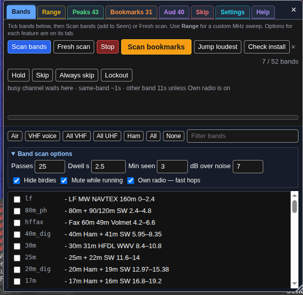
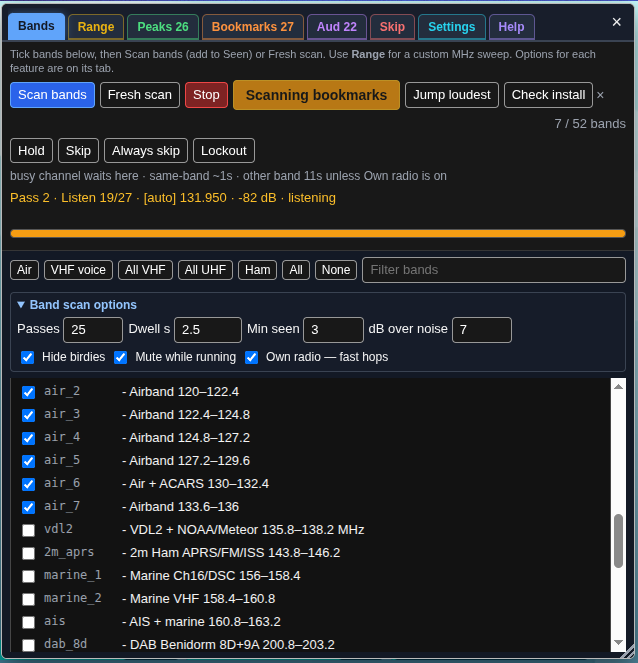
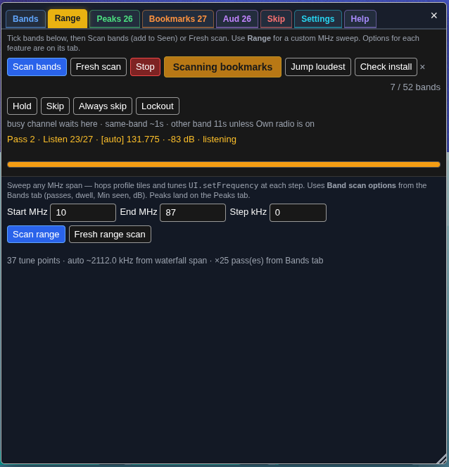
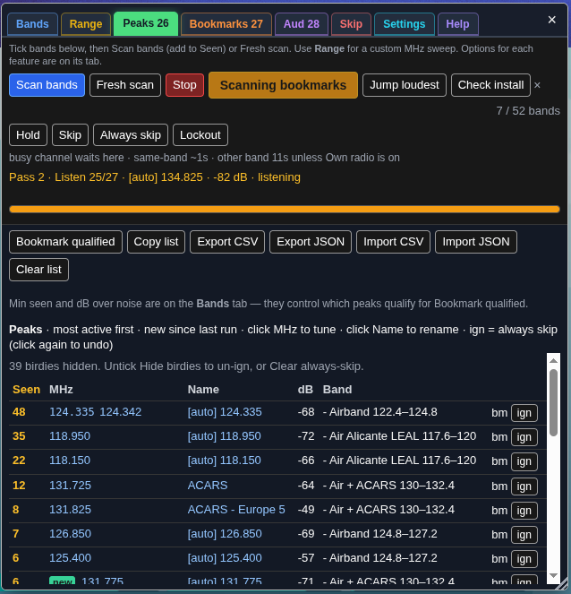
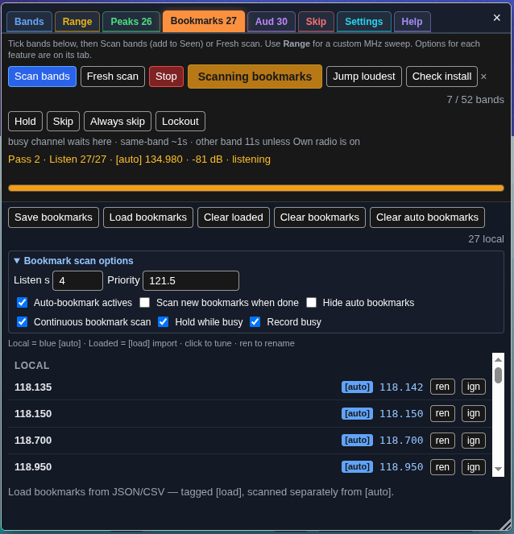
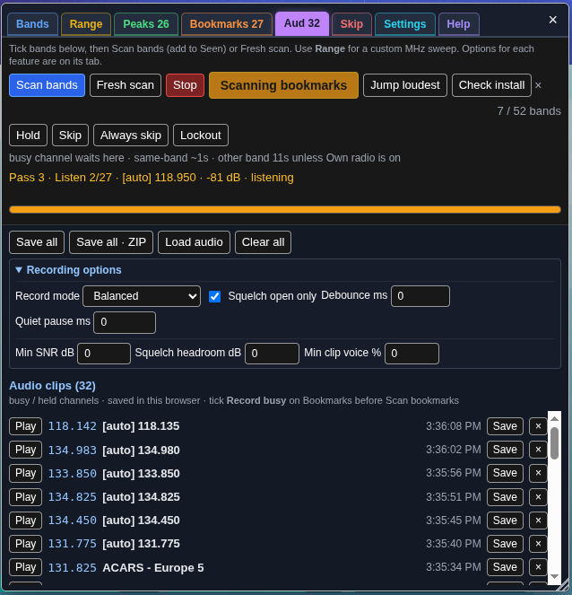
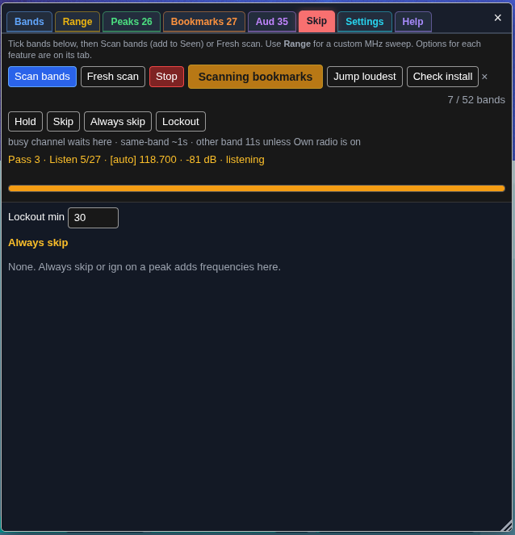
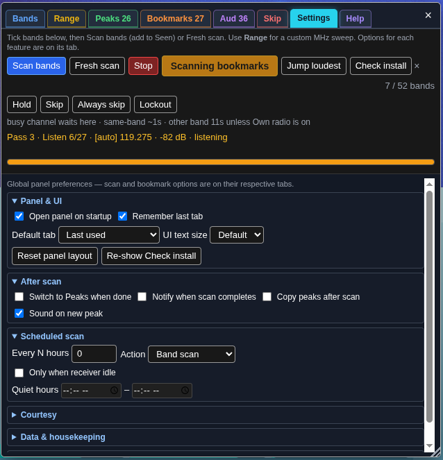
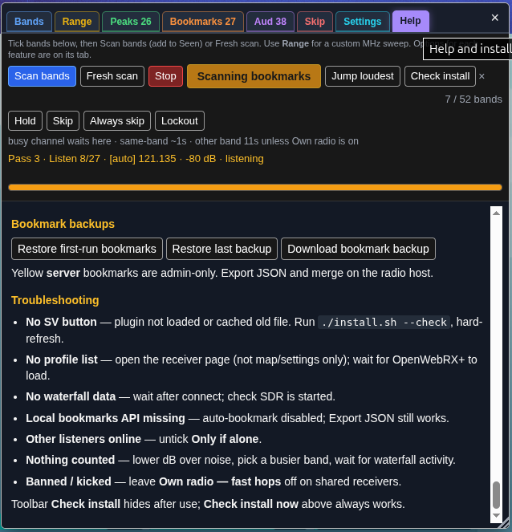

# Band survey — OpenWebRX+ plugin (v57)

Standalone receiver plugin. Walks the bands you tick (or a custom MHz range), counts
real waterfall peaks, ranks the busiest, and can bookmark them in **this browser**.

**v57:** Bookmark scan uses the same profile and frequency tuning as band scans (fixes hops when bookmarks are on other profiles).


<p>
  
</p>

<p><em>Orange <strong>SV</strong> on the right-hand receiver panel opens the survey.</em></p>

### All tabs

<p>
  <strong>Bands</strong><br>
  
</p>
<p>
  <strong>Range</strong><br>
  
</p>
<p>
  <strong>Peaks</strong><br>
  
</p>
<p>
  <strong>Bookmarks</strong><br>
  
</p>
<p>
  <strong>Audio</strong><br>
  
</p>
<p>
  <strong>Skip</strong><br>
  
</p>
<p>
  <strong>Settings</strong><br>
  
</p>
<p>
  <strong>Help</strong><br>
  
</p>

**Does not need** `freq_scanner`, `scan_hunt`, `uikit`, `utils`, or `notify`. Those are
optional extras if you already load them.

---

## Install

### Quick install (recommended)

On the radio host:

```bash
git clone https://github.com/G4EA5/owrx-band-survey.git
cd owrx-band-survey
chmod +x install.sh
./install.sh
```

Hard-refresh the receiver: **Ctrl+Shift+R** (Mac: **Cmd+Shift+R**). Click orange **SV**
→ **Check install**.

Verify without writing files:

```bash
./install.sh --check
```

**Public shared receiver** (hide **Own radio — fast hops** from visitors):

```bash
./install.sh --public
```

### Load from URL

Add inside your existing `async` block in `plugins/receiver/init.js`:

```js
await Plugins.load("https://cdn.jsdelivr.net/gh/G4EA5/owrx-band-survey@main/band_survey.js");
```

GitHub Pages (when live):

```js
await Plugins.load("https://g4ea5.github.io/owrx-band-survey/band_survey.js");
```

Raspberry Pi images with Varnish:

```bash
sudo systemctl restart varnish nginx
```

### Manual install

1. Find `htdocs` (folder containing `openwebrx.js`):

   ```bash
   find /usr /opt -name openwebrx.js 2>/dev/null
   ```

2. **Back up first:**

   ```bash
   HTDOCS=/usr/lib/python3/dist-packages/htdocs
   mkdir -p ~/owrx-band-survey-backups/manual
   cp -a "$HTDOCS/plugins/receiver/init.js" ~/owrx-band-survey-backups/manual/ 2>/dev/null || true
   cp -a "$HTDOCS/plugins/receiver/band_survey" ~/owrx-band-survey-backups/manual/ 2>/dev/null || true
   cp -a /var/lib/openwebrx/bookmarks.json ~/owrx-band-survey-backups/manual/ 2>/dev/null || true
   cp -a /var/lib/openwebrx/settings.json ~/owrx-band-survey-backups/manual/ 2>/dev/null || true
   ```

3. Copy this folder:

   ```bash
   sudo mkdir -p "$HTDOCS/plugins/receiver"
   sudo cp -a . "$HTDOCS/plugins/receiver/band_survey"
   ```

4. Add to `$HTDOCS/plugins/receiver/init.js`:

   ```js
   (async () => {
     await Plugins.load("band_survey");
   })();
   ```

   If you already have `init.js` (e.g. from
   [0xAF plugins](https://github.com/0xAF/openwebrxplus-plugins)), add only the
   `await Plugins.load("band_survey");` line inside your existing block.

5. Hard-refresh the receiver.

### What you need

- [OpenWebRX+](https://github.com/luarvique/openwebrx) (the `+` fork). Vanilla OpenWebRX
  has no plugin loader.
- SSH or file copy onto the radio host (for local install).
- A **hard** refresh after install.

### Install script details

`install.sh` backs up first, then copies the plugin and adds one load line to `init.js`
if missing. Backups go to:

`~/owrx-band-survey-backups/YYYYMMDD-HHMMSS/`

(includes `init.js`, previous `band_survey/`, `bookmarks.json`, `settings.json`, and
`RESTORE.txt`).

If `install.sh` cannot find OpenWebRX+:

```bash
export OWRX_HTDOCS=/path/to/htdocs
./install.sh
```

Typical `htdocs` paths:

- `/usr/lib/python3/dist-packages/htdocs` (Debian / Ubuntu package)
- `/opt/openwebrx/htdocs`

---

## Quick start

1. Hard-refresh: **Ctrl+Shift+R** / **Cmd+Shift+R**.
2. Click orange **SV** on the right-hand panel.
3. Click **Check install**. Green = ready.
4. Tick bands (or tap **Air**, **VHF voice**, **All VHF**, etc.) and press **Scan bands**.
5. Results appear on the **Peaks** tab. Hover any control for a tip.

| You see | Meaning |
| --- | --- |
| Orange **SV** | Plugin loaded |
| Band checkboxes | Profiles visible |
| **Check install** “looks good” | Ready to survey |
| Red / yellow box | Follow on-screen fix, then Check install again |

---

## Panel layout (v56)

Eight tabs in the title bar: **Bands**, **Range**, **Peaks**, **Bookmarks**, **Audio**,
**Skip**, **Settings**, **Help**.

Scan controls stay pinned in the **toolbar** below the tabs. Drag panel edges or the
corner to resize; drag the title bar to move. Default position: 12 vw from left, 28 vh
from top, 28 vw wide, 58 vh tall — remembered in this browser.

---

## Toolbar

| Control | What it does |
| --- | --- |
| **Scan bands** / **Scanning bands** | Walk ticked bands; add to Seen counts. Label changes during band or range scan. |
| **Fresh scan** | Clear peak list, then scan ticked bands from scratch. |
| **Stop** | Halt band survey, range survey, or bookmark scan. Auto-bookmarks qualified peaks when **Auto-bookmark actives** is on. |
| **Scan bookmarks** / **Scanning bookmarks** | Loop local and loaded bookmarks until Stop. Becomes **Continue scan bookmarks** when paused (continuous mode off + busy channel). |
| **Jump loudest** | Retune to strongest peak on **this waterfall tile only**. |
| **Check install** | Verify plugin and receiver. Dismiss with **×** or after success; restore via Settings → **Re-show Check install**. |
| **Hold** / **Skip** / **Always skip** / **Lockout** | During bookmark scan: stay, move on, skip forever, or skip for Lockout minutes. |

Status line below the toolbar reserves two lines so the panel does not bounce when text
wraps.

---

## Tab guide

### Bands

- **Presets** — **Air**, **VHF voice**, **All VHF** (30–300 MHz), **All UHF** (300–1000 MHz),
  **Ham**, **All**, **None**. Presets are **additive** (combine VHF+UHF; **None** clears all).
- **Band checkboxes** — include each SDR profile in **Scan bands**. Filter box hides
  non-matching names.
- **Band scan options** (expandable):
  - **Passes** — how many times to walk ticked bands per run.
  - **Dwell s** — seconds on each band while counting peaks.
  - **Min seen** — peaks below this Seen count do not qualify for auto-bookmark or
    **Bookmark qualified**.
  - **dB over noise** — peak must be this far above the noise floor.
- **Hide birdies** — hide always-skipped rows from the peak list.
- **Mute while running** — silence audio during band/range survey walks.
- **Own radio — fast hops** — ~1 s between profile changes instead of ~11 s. Only on a
  receiver you run yourself. Locked on public installs (`./install.sh --public`).

### Range

Custom MHz sweep — not tied to ticked bands. Plugin picks covering SDR profiles.

- **Start MHz** / **End MHz** — sweep span (e.g. 109–200).
- **Step kHz** — hop size. **0** = auto (~88% of waterfall span, min 12.5 kHz). Use
  500–2000 kHz for wide surveys.
- **Scan range** — add peaks to Seen.
- **Fresh range scan** — clear peak list first.
- Uses **Band scan options** from the Bands tab (passes, dwell, Min seen, dB).
- **Spectrum map** — after finish or Stop: green = new, amber = seen, pink = priority;
  bar height = dB; click a bar to tune.

### Peaks

Ranked survey results — sort by Seen, MHz, or dB.

| Action | Purpose |
| --- | --- |
| Click MHz | Tune receiver |
| Click name | Rename bookmark |
| **ign** / **un-ign** | Always skip / undo skip a birdie |
| **Bookmark qualified** | Save peaks with Seen ≥ Min seen as blue bookmarks |
| **Copy list** | Copy table as text |
| **Export CSV** / **Export JSON** | Download log; JSON for merging yellow server bookmarks |
| **Import CSV** / **Import JSON** | Restore Peaks/Seen (file picker; Shift-click to paste) |
| **Clear list** | Wipe peak table (bookmarks stay) |

### Bookmarks

- **Blue** local bookmarks — **[auto]** from surveys vs named.
- **Amber [load]** — imported list (separate from blue).
- **Save bookmarks** / **Load bookmarks** / **Clear loaded** / **Clear bookmarks** /
  **Clear auto bookmarks** / **ren** to rename.

**Bookmark scan options:**

| Option | Purpose |
| --- | --- |
| **Listen s** | Minimum seconds on each bookmark after ~0.7 s tune settle |
| **Priority** | MHz list (e.g. 121.5); guard/tower/ATIS added automatically; listened first |
| **Auto-bookmark actives** | Save busy peaks as **[auto]** (scan end and Stop) |
| **Scan new bookmarks when done** | One-shot bookmark scan after band survey |
| **Hide auto bookmarks** | Hide **[auto]** from OpenWebRX bookmark bar |
| **Continuous bookmark scan** | Loop without pausing on busy (default on) |
| **Hold while busy** | When continuous off: stay until ~1.5 s quiet; button becomes **Continue scan bookmarks** |
| **Record busy** | Capture demod audio while parked (see Audio tab) |

**Scan bookmarks** loops new auto bookmarks first, then all local and loaded. Same-band
hops ~1 s; other-band ~11 s (or ~1 s with **Own radio — fast hops**).

### Audio

Recorded clips from **Record busy** during bookmark scan. Persist in **IndexedDB**
across refresh and browser restart.

| Action | Purpose |
| --- | --- |
| **Save all** | Download each clip separately |
| **Save all · ZIP** | Bundle all clips (loads JSZip on first use) |
| **Load audio** | Add files from disk (nothing uploaded) |
| **Clear all** | Remove all clips from browser storage |
| **×** on a row | Remove one clip |

**Recording options:**

| Mode | Behaviour |
| --- | --- |
| **Original** (default) | Record on first waterfall-busy sample; no squelch/voice gating |
| **Balanced** | Squelch open + light debounce |
| **Strict voice** | Squelch + S-meter + SNR, pause on quiet, discard hiss |

Fine-tune (Balanced/Strict; Original ignores): **Squelch open only**, **Debounce ms**,
**Quiet pause ms**, **Min SNR dB**, **Squelch headroom dB**, **Min clip voice %**
(0 = mode default).

Default cap: 40 clips or ~48 MB (set **Max audio clips** on Settings). Scanner waits
≥2 s before hopping so clips are not cut off.

### Skip

- **Always skip** list — frequencies skipped forever. Add via **ign** or toolbar
  **Always skip**. Undo with **un-ign** or **Clear always-skip**.
- **Lockout min** — duration for toolbar **Lockout** skips (default 30 min).

### Help

Full in-panel manual (this document in condensed form), **Check install now**, and
bookmark backup buttons: **Restore first-run bookmarks**, **Restore last backup**,
**Download bookmark backup**.

---

## Settings reference

Global panel preferences. Scan and bookmark options live on their respective tabs.

### Panel & UI

| Setting | Default | Description |
| --- | --- | --- |
| **Open panel on startup** | off | Open SV when OpenWebRX loads (waits for band profiles) |
| **Remember last tab** | on | Restore tab between sessions |
| **Default tab** | Last used | Tab shown on open (Bands, Range, Peaks, …) |
| **UI text size** | Default | Small (~90%), Default, Large (~110%) |
| **Reset panel layout** | — | Restore default position and size |
| **Re-show Check install** | — | Put Check install back on toolbar |

### After scan

Applies on normal scan finish (not Stop).

| Setting | Default | Description |
| --- | --- | --- |
| **Switch to Peaks when done** | off | Jump to Peaks tab |
| **Notify when scan completes** | off | Desktop notification + status |
| **Copy peaks after scan** | off | Copy peak table to clipboard |
| **Sound on new peak** | on | Beep when a new peak is counted during scan |

### Scheduled scan

Runs while **this browser tab** stays open.

| Setting | Default | Description |
| --- | --- | --- |
| **Every N hours** | 0 (off) | Repeat interval |
| **Action** | Band scan | Band scan, Bookmark scan, or Both |
| **Only when receiver idle** | off | Skip if you tuned manually in last 10 min |
| **Quiet hours** | blank | No auto-scan between start and end (24 h, local) |

### Courtesy

| Setting | Default | Description |
| --- | --- | --- |
| **Pause scan when I tune manually** | off | Stop survey if you click the waterfall |
| **Notify new peak** | on | Browser notification for unseen peaks |
| **Only if alone** | on | Do not retune when other listeners online |
| **Profile settle ms** | 0 | Wait after profile change before sampling (0 = ~700 ms) |

### Data & housekeeping

| Setting | Default | Description |
| --- | --- | --- |
| **Export settings** | — | Download settings JSON (not peaks or audio) |
| **Import settings** | — | Merge settings from JSON file |
| **Reset settings** | — | Defaults (keeps peak list and bookmarks) |
| **Max peaks** | 0 (unlimited) | Trim oldest when exceeded |
| **Max audio clips** | 40 | IndexedDB cap (5–200) |
| **Clear all plugin data** | — | Wipe everything in this browser |

### Homelab

| Setting | Default | Description |
| --- | --- | --- |
| **Webhook URL** | blank | POST `{freq, name, db, band}` on each new peak |
| **Alert MHz list** | blank | Extra notify/sound when new peak within ± offset |
| **± kHz** | 25 | Alert frequency tolerance |

---

## Scan behaviour

### Band survey

Walks ticked SDR profiles. Counts waterfall peaks above **dB over noise** threshold.
Same-band hops ~1 s; cross-band profile changes ~11 s (or ~1 s with **Own radio — fast
hops**). **Scan bands** adds to Seen; **Fresh scan** clears first.

### Range survey

Hops MHz steps across profiles. Shares peak list and scan options with band survey.
Spectrum map shown after finish or Stop.

### Bookmark scan

- **Continuous mode** (default): loops until Stop; auto-hops after **Listen s** unless
  **Hold** pressed.
- **Pause mode** (continuous off): waits on busy channel; orange button becomes
  **Continue scan bookmarks**; use **Hold while busy**, **Skip**, or release **Hold**.

### Stop and auto-bookmark

Pressing **Stop** during band or range survey auto-bookmarks qualified peaks (Seen ≥
Min seen) when **Auto-bookmark actives** is on — same as normal scan end.

### Recording

**Record busy** captures demod audio only while parked on a bookmark — not during survey
walks or quiet hops.

---

## Persistence

| Data | Storage |
| --- | --- |
| Settings, peak list, skip list, panel position | **localStorage** |
| Audio clips | **IndexedDB** |
| Blue bookmarks | OpenWebRX local bookmark store |
| Bookmark backups | **localStorage** (first-run and last-backup copies) |

Nothing is uploaded except optional **Webhook URL** POSTs. Clearing site data removes
everything.

---

## Public vs own radio

Personal installs: you may tick **Own radio — fast hops** for ~1 s profile gaps.

Public shared OpenWebRX:

```bash
./install.sh --public
```

Or edit `band_survey.js`:

```js
var BAND_SURVEY_ALLOW_OWNER_OVERRIDE = false;
```

This hides the checkbox and always uses the 11 s gap. Not a hard security fence — enable
OpenWebRX **bot-ban** if you need the server to kick hoppers.

---

## Restore backups

**Peaks/Seen:** SV → **Import CSV** or **Import JSON**.

**Blue bookmarks:** Help tab → **Restore first-run bookmarks** or **Restore last backup**.

**Server files** (from `install.sh` backup):

```bash
ls ~/owrx-band-survey-backups
sudo cp ~/owrx-band-survey-backups/STAMP/init.js /usr/lib/python3/dist-packages/htdocs/plugins/receiver/init.js
sudo cp ~/owrx-band-survey-backups/STAMP/bookmarks.json /var/lib/openwebrx/bookmarks.json
```

Read `RESTORE.txt` in that stamp folder.

Yellow **server** bookmarks are admin-only. **Export JSON** and merge the `bookmarks`
array on the radio host.

---

## Troubleshooting

| Problem | Fix |
| --- | --- |
| **No SV button** | Plugin not loaded or cached old file. `./install.sh --check`, hard-refresh. |
| **No profile list** | Open receiver page (not map/settings only); wait for OpenWebRX+ to load. |
| **No waterfall data** | Wait after connect; check SDR is started. |
| **Local bookmarks API missing** | Auto-bookmark disabled; Export JSON still works. |
| **Other listeners online** | Untick **Only if alone**. |
| **Nothing counted** | Lower dB over noise, pick busier band, wait for waterfall activity. |
| **Banned / kicked** | Leave **Own radio — fast hops** off on shared receivers. |

Toolbar **Check install** hides after use; Help tab **Check install now** always works.

---

## Docker

Bind-mount `htdocs/plugins/receiver` and run:

```bash
export OWRX_HTDOCS=/path/on/host/that/is/htdocs
./install.sh
```

---

## Uninstall

```bash
sudo rm -rf "$HTDOCS/plugins/receiver/band_survey"
# remove Plugins.load("band_survey") from init.js
```

Or restore `init.js` from `~/owrx-band-survey-backups/…`.

---

## Upstream

Standalone tester repo. A later step can be a pull request into
[0xAF/openwebrxplus-plugins](https://github.com/0xAF/openwebrxplus-plugins). Until then,
clone or load from this repository.

## License

MIT — see `LICENSE`.
