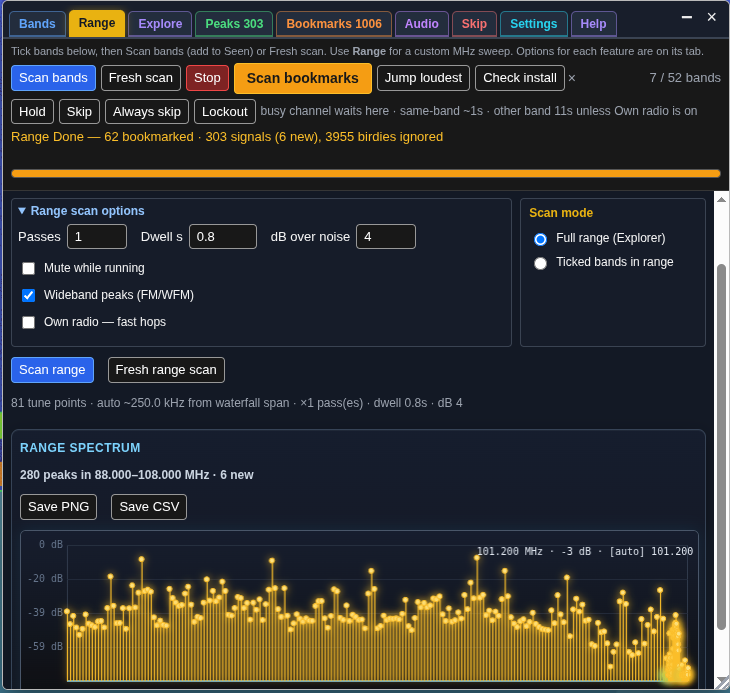
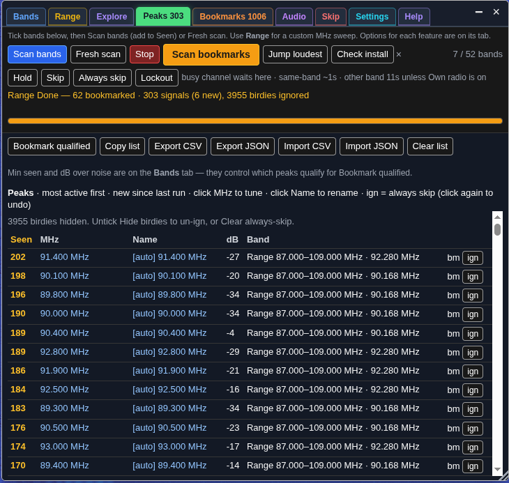
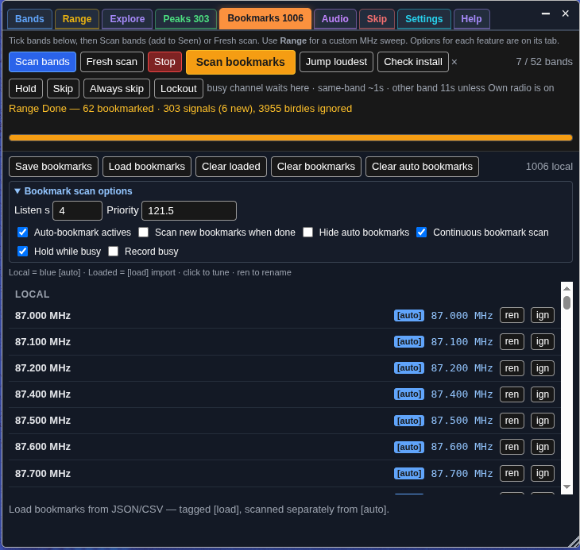

# Band survey — OpenWebRX+ plugin (v110)

> **Broken after updating to v91–v96?** No Survey button but `./install.sh --check` says OK?  
> Pull **v97+**, re-run `./install.sh`, then hard-refresh the receiver page (Ctrl+Shift+R).  
> F12 console may show `TAB_IDS` / `indexOf` — that was a startup crash in v91–v96, fixed in v97.

Standalone receiver plugin. Walks the bands you tick (or a custom MHz range), counts
real waterfall peaks, ranks the busiest, and can bookmark them in **this browser**.

**Works with any SDR OpenWebRX+ supports** (HackRF, RTL-SDR, Airspy, Lime, …) — the plugin
talks to the OpenWebRX+ UI, not to USB hardware directly. See
[SDR hardware](#sdr-hardware-hackrf-rtl-sdr-airspy-lime--).

**Recent (v110):** No floating orange **SV** when top-bar **Survey** is present (was a
duplicate reopen chip covering the status bar). **v109:** Range **Channel grid** with **Step kHz**, **Offset kHz**, and presets
(PMR446, Airband 25/8.33, LPD433, Marine, 2m/70cm FM, CB, FM broadcast, MW). Exact channel
centres instead of waterfall-coverage hops. **v97:** Fix init crash in v91–v96 (`TAB_IDS`).
**v96:** Top-bar **Survey** button; **Explore**; **Visible tabs**; experimental **Analyzer**.

## Where to start

After [install](#install) and a hard-refresh (**Ctrl+Shift+R** / **Cmd+Shift+R**), open the
receiver page and click **Survey** in the **top bar** — between **Help** and **Status**
(bar-graph icon). That opens the Band survey panel. If the top bar is missing, look for
orange **SV** on the frequency bar (fallback).

<p>
  
</p>

<p><em>Click <strong>Survey</strong> (highlighted above) to open the panel, then use <strong>Check install</strong> on the toolbar.</em></p>

**Does not need** `freq_scanner`, `scan_hunt`, `uikit`, `utils`, or `notify`. Those are
optional extras if you already load them.

---

### Screenshots — FM broadcast range survey (88–108 MHz)

<p>
  <strong>Range</strong> — full-span scan with spectrum chart (280 peaks, wideband FM detection)<br>
  
</p>
<p>
  <strong>Peaks</strong> — ranked signal list from the same scan<br>
  
</p>
<p>
  <strong>Bookmarks</strong> — auto-bookmarked carriers<br>
  
</p>
<p>
  <strong>Bands</strong> — scan options (wideband peaks, dB threshold, passes)<br>
  
</p>

---

## SDR hardware (HackRF, RTL-SDR, Airspy, Lime, …)

Band survey is an **OpenWebRX+ browser plugin**. It does **not** open `/dev/hackrf0`,
run `hackrf_sweep`, or talk to Soapy/USB itself.

| Layer | Role |
| --- | --- |
| Your SDR (HackRF, RTL-SDR, …) | Owned by OpenWebRX+ / SoapySDR |
| OpenWebRX+ receiver page | Profiles, waterfall FFT, tune / profile hop |
| Band survey | Reads waterfall, switches profiles, bookmarks in **this browser** |

**If** OpenWebRX already shows a normal waterfall and an SDR profile list for that radio,
this plugin can survey it — same code path for HackRF, RTL-SDR, Airspy, Lime, etc.

Practical differences by setup:

- **Profiles must cover the MHz you scan.** Range, Explore, and Analyzer only hop where
  profiles allow. One wide HackRF profile behaves differently from many ~2.4 MHz RTL slices.
- **Bandwidth comes from OpenWebRX** (`window.bandwidth`). Hop step and “tile” size follow
  the active profile, not a fixed HackRF sweep bin width.
- **Presets** (Air, FM, …) match common profile id/name patterns (`air_`, `fm_`, …). Custom
  names still work — tick bands manually or use **All**.
- **Analyzer** (experimental, off by default) draws from the live OWRX waterfall (relative
  dB). It is **not** a standalone [HackRF sweep visualizer](https://github.com/G4EA5/hackrf_sweep_visualizer_v1).
- Vanilla OpenWebRX (no `+`) cannot load plugins.

---

## Install

### Quick install (recommended)

On the radio host:

```bash
git clone https://github.com/G4EA5/owrx-band-survey.git
cd owrx-band-survey
chmod +x install.sh
./install.sh
```

Hard-refresh the receiver: **Ctrl+Shift+R** (Mac: **Cmd+Shift+R**). Click **Survey**
→ **Check install**.

Verify without writing files (writes a full diagnostic log):

```bash
./install.sh --check
```

Report only (same log, no install):

```bash
./install.sh --report
```

Logs go to `~/owrx-band-survey-reports/band-survey-report-*.txt` (OS, Pi/Docker detection, file checks, HTTP probe, Mac browser hints). Pick a setup type when prompted, or:

```bash
./install.sh --profile pi          # Raspberry Pi image
./install.sh --profile mac-browser # you browse from Mac; install runs on the server
```

**Public shared receiver** (hide **Own radio — fast hops** from visitors):

```bash
./install.sh --public
```

### Load from URL

Add inside your existing `async` block in `plugins/receiver/init.js`:

```js
await Plugins.load("https://cdn.jsdelivr.net/gh/G4EA5/owrx-band-survey@main/band_survey.js");
```

GitHub Pages (when live):

```js
await Plugins.load("https://g4ea5.github.io/owrx-band-survey/band_survey.js");
```

Raspberry Pi images with Varnish:

```bash
sudo systemctl restart varnish nginx
```

### Manual install

1. Find `htdocs` (folder containing `openwebrx.js`):

   ```bash
   find /usr /opt -name openwebrx.js 2>/dev/null
   ```

2. **Back up first:**

   ```bash
   HTDOCS=/usr/lib/python3/dist-packages/htdocs
   mkdir -p ~/owrx-band-survey-backups/manual
   cp -a "$HTDOCS/plugins/receiver/init.js" ~/owrx-band-survey-backups/manual/ 2>/dev/null || true
   cp -a "$HTDOCS/plugins/receiver/band_survey" ~/owrx-band-survey-backups/manual/ 2>/dev/null || true
   cp -a /var/lib/openwebrx/bookmarks.json ~/owrx-band-survey-backups/manual/ 2>/dev/null || true
   cp -a /var/lib/openwebrx/settings.json ~/owrx-band-survey-backups/manual/ 2>/dev/null || true
   ```

3. Copy the plugin files into `htdocs` (repo root is the plugin — there is no nested `band_survey/` folder):

   ```bash
   sudo mkdir -p "$HTDOCS/plugins/receiver/band_survey"
   sudo cp -a band_survey.js band_survey.css README.md LICENSE install.sh \
     "$HTDOCS/plugins/receiver/band_survey/"
   ```

4. Add to `$HTDOCS/plugins/receiver/init.js`:

   ```js
   (async () => {
     await Plugins.load("band_survey");
   })();
   ```

   If you already have `init.js` (e.g. from
   [0xAF plugins](https://github.com/0xAF/openwebrxplus-plugins)), add only the
   `await Plugins.load("band_survey");` line inside your existing block.

5. Hard-refresh the receiver.

### What you need

- [OpenWebRX+](https://github.com/luarvique/openwebrx) (the `+` fork). Vanilla OpenWebRX
  has no plugin loader.
- An SDR that OpenWebRX+ already drives (RTL-SDR, HackRF, Airspy, LimeSDR, etc.) with at
  least one **profile** and a live **waterfall** on the receiver page.
- SSH or file copy onto the radio host (for local install).
- A **hard** refresh after install.

### Install script details

`install.sh` backs up first, then copies the plugin and adds one load line to `init.js`
if missing. Backups go to:

`~/owrx-band-survey-backups/YYYYMMDD-HHMMSS/`

Diagnostic reports go to:

`~/owrx-band-survey-reports/band-survey-report-*.txt`

(includes OS/hardware detection, file checksums, service status, HTTP probe, and
browser next-steps tailored to Pi / Docker / Mac / Linux).

Backup folder also includes `init.js`, previous `band_survey/`, `bookmarks.json`,
`settings.json`, `RESTORE.txt`, and `diagnostic-report.txt` after install.

If `install.sh` cannot find OpenWebRX+:

```bash
export OWRX_HTDOCS=/path/to/htdocs
./install.sh
```

Typical `htdocs` paths:

- `/usr/lib/python3/dist-packages/htdocs` (Debian / Ubuntu package, many Docker images)
- `/opt/openwebrx/htdocs`

### Docker (OpenWebRX+ in a container)

You need **OpenWebRX+** (image must include `plugins.js`). Vanilla OpenWebRX images
cannot load plugins.

Band survey files must end up in **`htdocs/plugins/receiver/band_survey/`** with
`await Plugins.load("band_survey");` in **`init.js`**. How you get them there depends
on your compose file.

#### Method 1 — Install inside the container (usual)

On the **Docker host**:

```bash
docker ps                                    # note container name, e.g. openwebrx
docker exec -it openwebrx bash               # shell inside container
```

Inside the container:

```bash
find /usr /opt -name openwebrx.js 2>/dev/null   # confirm htdocs path
# common: /usr/lib/python3/dist-packages/htdocs

apt-get update && apt-get install -y git        # if git is missing

cd /tmp
git clone https://github.com/G4EA5/owrx-band-survey.git
cd owrx-band-survey
chmod +x install.sh
./install.sh --profile docker
./install.sh --check
exit
```

Restart the container (some images cache static files):

```bash
docker restart openwebrx
```

Then hard-refresh the receiver page (**Ctrl+Shift+R** / **Cmd+Shift+R**) and click
**Survey** (or orange **SV**).

If auto-detect cannot find htdocs inside the container:

```bash
export OWRX_HTDOCS=/usr/lib/python3/dist-packages/htdocs
./install.sh --profile docker
```

Verify from the host without opening a shell:

```bash
docker exec openwebrx bash -c 'cd /tmp/owrx-band-survey && ./install.sh --report'
```

Reports are written **inside the container** at `~/owrx-band-survey-reports/` unless
you bind-mount home — copy out with `docker cp` if needed.

**Note:** If you `docker compose down` and recreate the container **without** a volume
on `plugins/receiver`, an in-container install is lost. Use Method 2 for persistence,
or re-run `./install.sh` after recreate.

#### Method 2 — Bind-mount `plugins/receiver` from the host (persistent)

If your `docker-compose.yml` mounts the receiver plugin tree from the host, e.g.:

```yaml
volumes:
  - ./plugins/receiver:/usr/lib/python3/dist-packages/htdocs/plugins/receiver
```

Install on the **host** into that folder (or run `install.sh` on the host with
`OWRX_HTDOCS` pointing at the parent `htdocs` if you mount all of it):

```bash
git clone https://github.com/G4EA5/owrx-band-survey.git
cd owrx-band-survey
export OWRX_HTDOCS=/path/to/your/openwebrx/htdocs   # parent of plugins/receiver
chmod +x install.sh
./install.sh --profile docker
docker restart openwebrx
```

Ensure `init.js` on the **host mount** includes:

```js
await Plugins.load("band_survey");
```

**Read-only mounts:** if the volume is `:ro`, the installer cannot write — remove
`:ro` for install, or copy files into the host source directory by hand, then restart.

#### Docker Desktop on Mac or Windows

Docker runs Linux containers; install steps are the same (`docker exec` on the host).
Your **browser** on Mac/Windows still needs a hard refresh on the receiver page —
install does not run on the Mac itself unless OpenWebRX+ is natively installed there
(unusual).

#### Public shared Docker receiver

```bash
docker exec -it openwebrx bash
cd /tmp/owrx-band-survey && ./install.sh --public --profile docker
```

---

## Quick start

1. Hard-refresh: **Ctrl+Shift+R** / **Cmd+Shift+R**.
2. Click **Survey** in the top bar (between **Help** and **Status**) — see [Where to start](#where-to-start).
3. Click **Check install**. Green = ready.
4. Tick bands (or tap **Air**, **VHF voice**, **All VHF**, etc.) and press **Scan bands**.
5. Results appear on the **Peaks** tab. Hover any control for a tip (one tip at a time — no double browser+custom tips).

| You see | Meaning |
| --- | --- |
| **Survey** (or orange **SV**) | Plugin loaded |
| Band checkboxes | Profiles visible |
| **Check install** “looks good” | Ready to survey |
| Red / yellow box | Follow on-screen fix, then Check install again |

---

## Panel layout

Tabs: **Bands**, **Range**, **Explore**, **Analyzer** (experimental, off by default),
**Peaks**, **Bookmarks**, **Audio**, **Skip**, **Settings**, **Help**.

Hide any tab under Settings → **Visible tabs**. **Show all tabs** restores everything
except Analyzer (still off until you tick it). Settings always stays on.

Scan controls stay pinned in the **toolbar** below the tabs. Drag panel edges or the
corner to resize; drag the title bar to move. Default position: 12 vw from left, 28 vh
from top, 28 vw wide, 58 vh tall — remembered in this browser.

---

## Toolbar

| Control | What it does |
| --- | --- |
| **Scan bands** / **Scanning bands** | Walk ticked bands; add to Seen counts. Label changes during band or range scan. |
| **Fresh scan** | Clear peak list, then scan ticked bands from scratch. |
| **Stop** | Halt band survey, range survey, or bookmark scan. Auto-bookmarks qualified peaks when **Auto-bookmark actives** is on. |
| **Scan bookmarks** / **Scanning bookmarks** | Loop local and loaded bookmarks until Stop. Becomes **Continue scan bookmarks** when paused (continuous mode off + busy channel). |
| **Jump loudest** | Retune to strongest peak on **this waterfall tile only**. |
| **Check install** | Verify plugin and receiver. Dismiss with **×** or after success; restore via Settings → **Re-show Check install**. |
| **Hold** / **Skip** / **Always skip** / **Lockout** | During bookmark scan: stay, move on, skip forever, or skip for Lockout minutes. |

Status line below the toolbar reserves two lines so the panel does not bounce when text
wraps.

---

## Tab guide

### Bands

- **Presets** — **Air**, **VHF voice**, **All VHF** (30–300 MHz), **All UHF** (300–1000 MHz),
  **Ham**, **All**, **None**. Presets are **additive** (combine VHF+UHF; **None** clears all).
- **Band checkboxes** — include each SDR profile in **Scan bands**. Filter box hides
  non-matching names.
- **Band scan options** (expandable):
  - **Passes** — how many times to walk ticked bands per run.
  - **Dwell s** — seconds on each band while counting peaks.
  - **Min seen** — peaks below this Seen count do not qualify for auto-bookmark or
    **Bookmark qualified**.
  - **dB over noise** — peak must be this far above the noise floor.
- **Hide birdies** — hide always-skipped rows from the peak list.
- **Mute while running** — silence audio during band/range survey walks.
- **Only if alone** — do not retune when other listeners are online (also on Range and
  Settings → Courtesy).
- **Own radio — fast hops** — ~1 s between profile changes instead of ~11 s. Only on a
  receiver you run yourself. Locked on public installs (`./install.sh --public`).

### Range

Custom MHz sweep — not tied to ticked bands. Plugin picks covering SDR profiles.

- **Start MHz** / **End MHz** — sweep span (e.g. 109–200). For channel grids, use the
  band edge / nominal start (e.g. **446** for PMR446).
- **Step kHz** — hop size. In auto coverage, **0** = ~88% of waterfall span (min 12.5 kHz).
  In **Channel grid**, this is channel spacing (e.g. **12.5** for PMR446).
- **Offset kHz** — channel grid only: first tune = Start + offset (PMR446: offset **6.25**
  → 446.00625 MHz).
- **Channel grid** + **Grid preset** — hop exact channel centres. Presets: Airband 25 /
  8.33 kHz, PMR446 12.5 / 6.25, LPD433, Marine VHF ~25 kHz, 2m / 70cm FM, CB, FM broadcast
  100/200 kHz, MW AM 9/10 kHz, or **Custom**. Off = previous waterfall-coverage behaviour.
- **Scan range** — add peaks to Seen.
- **Fresh range scan** — clear peak list first.
- **Full range (Explorer)** vs **Ticked bands only** — full span hops every step; bands
  mode only covers overlapping ticked profiles (channel grid N/A).
- **Range scan options** (on Range tab, synced with Bands): Passes, Dwell, Min seen,
  dB, Hide birdies, Wideband peaks, Mute, **Only if alone**, Own radio.
- **Spectrum map** — after finish or Stop: green = new, amber = seen, pink = priority;
  bar height = dB; ≥12 frequency labels on the X-axis; click a bar to tune.

### Explore

Browse the **whole** spectrum — every SDR profile in frequency order (not the ticked
Bands list). Tile width follows the active profile bandwidth (often ~2.4 MHz on RTL
setups; wider on many HackRF profiles).

- Turn **Explore on**, then drag the waterfall sideways (≥⅓ width) to hop tiles,
  short-click to tune, Alt+wheel to hop.
- **◀ ▶** hop one tile at a time.
- For automated sweeps use **Range → Full range (Explorer)**.

### Analyzer (experimental)

Live spectrum + mini-waterfall from the OpenWebRX waterfall (relative / uncalibrated dB).
**Off by default** — enable under Settings → **Visible tabs** → **Analyzer · experimental**.
**Show all tabs** does not turn it on.

- Set **Start** / **End** MHz (or presets: FM, Air, 2m, 70cm, ADS-B), press **Live on**.
- Wide spans hop tiles like Range; **Follow tile** stays on the current waterfall only.
- Peak hold, averaging, dB scale, and hop ms live under **Analyzer settings** on that tab.
- Click the plot to tune.
- Basic only — not a full HackRF sweep console.

### Peaks

Ranked survey results — sort by Seen, MHz, or dB.

| Action | Purpose |
| --- | --- |
| Click MHz | Tune receiver |
| Click name | Rename bookmark |
| **ign** / **un-ign** | Always skip / undo skip a birdie |
| **Bookmark qualified** | Save peaks with Seen ≥ Min seen as blue bookmarks |
| **Copy list** | Copy table as text |
| **Export CSV** / **Export JSON** | Download log; JSON for merging yellow server bookmarks |
| **Import CSV** / **Import JSON** | Restore Peaks/Seen (file picker; Shift-click to paste) |
| **Clear list** | Wipe peak table (bookmarks stay) |

### Bookmarks

- **Blue** local bookmarks — **[auto]** from surveys vs named.
- **Amber [load]** — imported list (separate from blue).
- **Save bookmarks** / **Load bookmarks** / **Clear loaded** / **Clear bookmarks** /
  **Clear auto bookmarks** / **ren** to rename.

**Bookmark scan options:**

| Option | Purpose |
| --- | --- |
| **Listen s** | Minimum seconds on each bookmark after ~0.7 s tune settle |
| **Priority** | MHz list (e.g. 121.5); guard/tower/ATIS added automatically; listened first |
| **Auto-bookmark actives** | Save busy peaks as **[auto]** (scan end and Stop) |
| **Scan new bookmarks when done** | One-shot bookmark scan after band survey |
| **Hide auto bookmarks** | Hide **[auto]** from OpenWebRX bookmark bar |
| **Continuous bookmark scan** | Loop without pausing on busy (default on) |
| **Hold while busy** | When continuous off: stay until ~1.5 s quiet; button becomes **Continue scan bookmarks** |
| **Record busy** | Capture demod audio while parked (see Audio tab) |

**Scan bookmarks** loops new auto bookmarks first, then all local and loaded. Same-band
hops ~1 s; other-band ~11 s (or ~1 s with **Own radio — fast hops**).

### Audio

Recorded clips from **Record busy** during bookmark scan. Persist in **IndexedDB**
across refresh and browser restart.

| Action | Purpose |
| --- | --- |
| **Save all** | Download each clip separately |
| **Save all · ZIP** | Bundle all clips (loads JSZip on first use) |
| **Load audio** | Add files from disk (nothing uploaded) |
| **Clear all** | Remove all clips from browser storage |
| **×** on a row | Remove one clip |

**Recording options:**

| Mode | Behaviour |
| --- | --- |
| **Original** (default) | Record on first waterfall-busy sample; no squelch/voice gating |
| **Balanced** | Squelch open + light debounce |
| **Strict voice** | Squelch + S-meter + SNR, pause on quiet, discard hiss |

Fine-tune (Balanced/Strict; Original ignores): **Squelch open only**, **Debounce ms**,
**Quiet pause ms**, **Min SNR dB**, **Squelch headroom dB**, **Min clip voice %**
(0 = mode default).

Default cap: 40 clips or ~48 MB (set **Max audio clips** on Settings). Scanner waits
≥2 s before hopping so clips are not cut off.

### Skip

- **Always skip** list — frequencies skipped forever. Add via **ign** or toolbar
  **Always skip**. Undo with **un-ign** or **Clear always-skip**.
- **Lockout min** — duration for toolbar **Lockout** skips (default 30 min).

### Help

Full in-panel manual (this document in condensed form), **Check install now**, and
bookmark backup buttons: **Restore first-run bookmarks**, **Restore last backup**,
**Download bookmark backup**.

---

## Settings reference

Global panel preferences. Scan and bookmark options live on their respective tabs.

### Panel & UI

| Setting | Default | Description |
| --- | --- | --- |
| **Open panel on startup** | off | Open SV when OpenWebRX loads (waits for band profiles) |
| **Remember last tab** | on | Restore tab between sessions |
| **Default tab** | Last used | Tab shown on open (Bands, Range, Peaks, …) |
| **UI text size** | Default | Small (~90%), Default, Large (~110%) |
| **Visible tabs** | all on except Analyzer | Untick tabs for a minimal bar. **Analyzer** is experimental and off by default; **Show all tabs** still leaves Analyzer off. Settings always stays on |
| **Reset panel layout** | — | Restore default / waterfall / saved position |
| **Re-show Check install** | — | Put Check install back on toolbar |

### After scan

Applies on normal scan finish (not Stop).

| Setting | Default | Description |
| --- | --- | --- |
| **Switch to Peaks when done** | off | Jump to Peaks tab |
| **Notify when scan completes** | off | Desktop notification + status |
| **Copy peaks after scan** | off | Copy peak table to clipboard |
| **Sound on new peak** | on | Beep when a new peak is counted during scan |

### Scheduled scan

Runs while **this browser tab** stays open.

| Setting | Default | Description |
| --- | --- | --- |
| **Every N hours** | 0 (off) | Repeat interval |
| **Action** | Band scan | Band scan, Bookmark scan, or Both |
| **Only when receiver idle** | off | Skip if you tuned manually in last 10 min |
| **Quiet hours** | blank | No auto-scan between start and end (24 h, local) |

### Courtesy

| Setting | Default | Description |
| --- | --- | --- |
| **Pause scan when I tune manually** | off | Stop survey if you click the waterfall |
| **Notify new peak** | on | Browser notification for unseen peaks |
| **Only if alone** | on | Do not retune when other listeners online (also on Range / Bands) |
| **Profile settle ms** | 0 | Wait after profile change before sampling (0 = ~700 ms) |

### Data & housekeeping

| Setting | Default | Description |
| --- | --- | --- |
| **Export settings** | — | Download settings JSON (not peaks or audio) |
| **Import settings** | — | Merge settings from JSON file |
| **Reset settings** | — | Defaults (keeps peak list and bookmarks) |
| **Max peaks** | 0 (unlimited) | Trim oldest when exceeded. Try 1000–2000 if the panel feels slow. |
| **Keep peaks between sessions** | on | Off = fresh peak list each browser session (faster). Export CSV first if you need the old list. |
| **Max audio clips** | 40 | IndexedDB cap (5–200) |
| **Clear all plugin data** | — | Wipe everything in this browser |

### Homelab

| Setting | Default | Description |
| --- | --- | --- |
| **Webhook URL** | blank | POST `{freq, name, db, band}` on each new peak |
| **Alert MHz list** | blank | Extra notify/sound when new peak within ± offset |
| **± kHz** | 25 | Alert frequency tolerance |

---

## Scan behaviour

### Band survey

Walks ticked SDR profiles. Counts waterfall peaks above **dB over noise** threshold.
Same-band hops ~1 s; cross-band profile changes ~11 s (or ~1 s with **Own radio — fast
hops**). **Scan bands** adds to Seen; **Fresh scan** clears first.

### Range survey

Hops MHz steps across profiles (waterfall coverage, or exact **channel grid** centres when
that mode is on). Shares peak list and scan options with band survey.
Spectrum map shown after finish or Stop.

### Bookmark scan

- **Continuous mode** (default): loops until Stop; auto-hops after **Listen s** unless
  **Hold** pressed.
- **Pause mode** (continuous off): waits on busy channel; orange button becomes
  **Continue scan bookmarks**; use **Hold while busy**, **Skip**, or release **Hold**.

### Stop and auto-bookmark

Pressing **Stop** during band or range survey auto-bookmarks qualified peaks (Seen ≥
Min seen) when **Auto-bookmark actives** is on — same as normal scan end.

### Recording

**Record busy** captures demod audio only while parked on a bookmark — not during survey
walks or quiet hops.

---

## Persistence

| Data | Storage |
| --- | --- |
| Settings, peak list, skip list, panel position | **localStorage** |
| Audio clips | **IndexedDB** |
| Blue bookmarks | OpenWebRX local bookmark store |
| Bookmark backups | **localStorage** (first-run and last-backup copies) |

Nothing is uploaded except optional **Webhook URL** POSTs. Clearing site data removes
everything.

---

## Public vs own radio

Personal installs: you may tick **Own radio — fast hops** for ~1 s profile gaps.

Public shared OpenWebRX:

```bash
./install.sh --public
```

Or edit `band_survey.js`:

```js
var BAND_SURVEY_ALLOW_OWNER_OVERRIDE = false;
```

This hides the checkbox and always uses the 11 s gap. Not a hard security fence — enable
OpenWebRX **bot-ban** if you need the server to kick hoppers.

---

## Restore backups

**Peaks/Seen:** Survey → **Import CSV** or **Import JSON**.

**Blue bookmarks:** Help tab → **Restore first-run bookmarks** or **Restore last backup**.

**Server files** (from `install.sh` backup):

```bash
ls ~/owrx-band-survey-backups
sudo cp ~/owrx-band-survey-backups/STAMP/init.js /usr/lib/python3/dist-packages/htdocs/plugins/receiver/init.js
sudo cp ~/owrx-band-survey-backups/STAMP/bookmarks.json /var/lib/openwebrx/bookmarks.json
```

Read `RESTORE.txt` in that stamp folder.

Yellow **server** bookmarks are admin-only. **Export JSON** and merge the `bookmarks`
array on the radio host.

---

## Troubleshooting

| Problem | Fix |
| --- | --- |
| **Server check OK but no SV button** | Hard-refresh the **receiver** page (Ctrl+Shift+R / Cmd+Shift+R). Not map-only or admin. Pi: `sudo systemctl restart varnish nginx`. Run `./install.sh --report` and check browser steps in the log. If you updated to **v91–v96**, pull **v97+** — those builds could crash on load (`TAB_IDS`) with a clean server check; F12 console showed the error. |
| **No Survey / SV button** | Plugin not loaded or cached old file. `./install.sh --check`, hard-refresh. |
| **PermissionError on init.js** | Files left mode `600`. Re-run `./install.sh` (v91+ sets `chmod 644` on plugin + `init.js`). |
| **Install “didn’t work” but --check passes** | Install is on the server; the browser still has a cached page. Hard-refresh on the PC/Mac you listen from. Help → **Copy diagnostic report**. |
| **Slow panel / many stored peaks** | Settings → **Max peaks** (1000–2000) or untick **Keep peaks between sessions**. Peaks load when you open Survey, not on page load. |
| **No profile list** | Open receiver page (not map/settings only); wait for OpenWebRX+ to load. |
| **No waterfall data** | Wait after connect; check SDR is started in OpenWebRX. Plugin needs the receiver waterfall, not a standalone HackRF app. |
| **Range/Analyzer skip large spans** | No profile covers that MHz — add OpenWebRX profiles, or narrow Start/End. |
| **Presets tick nothing** | Profile ids do not match Air/FM patterns — tick bands manually or use **All**. |
| **Analyzer missing** | Experimental and off by default. Settings → **Visible tabs** → enable **Analyzer · experimental**. |
| **Local bookmarks API missing** | Auto-bookmark disabled; Export JSON still works. |
| **Other listeners online** | Untick **Only if alone** on Range, Bands, or Settings → Courtesy. |
| **Nothing counted** | Lower dB over noise, pick busier band, wait for waterfall activity. Wideband peaks for FM/HF broadcast. |
| **Banned / kicked** | Leave **Own radio — fast hops** off on shared receivers. |

**Diagnostic logs:** `./install.sh --report` on the radio host (SSH). **Browser side:** Survey → Help → **Copy diagnostic report**. Send both if asking for help.

Toolbar **Check install** hides after use; Help tab **Check install now** always works.

See **[Docker](#docker-openwebrx-in-a-container)** under Install for container install steps.

---

## Uninstall

```bash
sudo rm -rf "$HTDOCS/plugins/receiver/band_survey"
# remove Plugins.load("band_survey") from init.js
```

Or restore `init.js` from `~/owrx-band-survey-backups/…`.

---

## Upstream

Standalone tester repo. A later step can be a pull request into
[0xAF/openwebrxplus-plugins](https://github.com/0xAF/openwebrxplus-plugins). Until then,
clone or load from this repository.

## License

MIT — see `LICENSE`.
