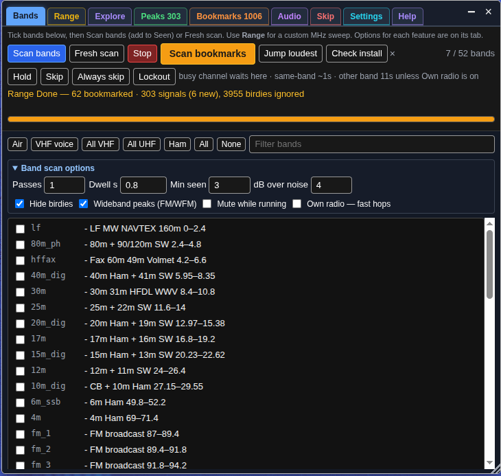
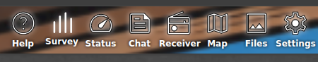

# Legacy Band Survey (`band_survey`)

This folder holds the **last Band Survey release** before the project became
**OpenWebRX Toolbox** (`toolbox`).

| | |
| --- | --- |
| **Plugin id** | `band_survey` |
| **Version** | **127** |
| **Files** | `band_survey.js`, `band_survey.css` |

The frozen plugin lives **only** in this folder. Prefer **Toolbox** from the repo root.

## You almost certainly want Toolbox instead

**Toolbox** includes every Band Survey feature and a lot more (Explore, Audio,
Extras, public allowlist, side dock, …). Install from the repo root:

```bash
./install.sh
```

**Do not load Band Survey and Toolbox together** — they share the same UI hooks
and will clash.

## Install Band Survey only (not recommended)

```bash
# On the radio host, into OpenWebRX+ htdocs:
HTDOCS=/usr/lib/python3/dist-packages/htdocs   # adjust if needed
sudo mkdir -p "$HTDOCS/plugins/receiver/band_survey"
sudo cp -a band_survey.js band_survey.css \
  "$HTDOCS/plugins/receiver/band_survey/"
```

In `plugins/receiver/init.js`, load **only** Band Survey (never both):

```js
await Plugins.load("band_survey");
```

## Older versions

After GitHub **Releases** / **tags** are published for this repo, download a
specific version from the Releases page, or:

```bash
git clone https://github.com/G4EA5/openwebrx-toolbox.git
cd openwebrx-toolbox
git checkout <tag-or-commit>   # e.g. a band-survey-v* tag when available
```

jsDelivr (pin a commit or tag — on current `main`, Band Survey lives under
`legacy/band_survey/`):

```text
https://cdn.jsdelivr.net/gh/G4EA5/openwebrx-toolbox@main/legacy/band_survey/band_survey.js
https://cdn.jsdelivr.net/gh/G4EA5/openwebrx-toolbox@band-survey-v110/band_survey.js
```

## Screenshots (Band Survey era)

<p>
  <strong>Range</strong> — FM broadcast range survey with spectrum<br>
  
</p>
<p>
  <strong>Peaks</strong> — ranked list from the same scan<br>
  
</p>
<p>
  <strong>Bookmarks</strong> — auto-bookmarked carriers<br>
  
</p>
<p>
  <strong>Bands</strong> — scan options<br>
  
</p>
<p>
  <strong>Top bar</strong> — Survey button (Band Survey naming)<br>
  
</p>
